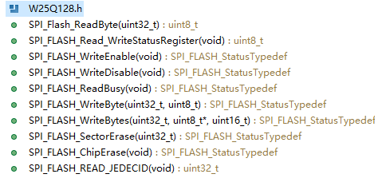

W25Q128函数讲解

板级支持包W25Q128包含以下函数



```c++
uint8_t SPI_Flash_ReadByte(uint32_t ADDR);
SPI_FLASH_StatusTypedef SPI_FLASH_ReadBusy(void);
SPI_FLASH_StatusTypedef SPI_FLASH_WriteEnable(void);
SPI_FLASH_StatusTypedef SPI_FLASH_WriteDisable(void);
SPI_FLASH_StatusTypedef SPI_FLASH_WriteByte(uint32_t ADDR, uint8_t Data);
SPI_FLASH_StatusTypedef SPI_FLASH_WriteBytes(uint32_t ADDR, uint8_t *pBuffer,uint16_t Size);
SPI_FLASH_StatusTypedef SPI_FLASH_SectorErase(uint32_t ADDR);
SPI_FLASH_StatusTypedef SPI_FLASH_ChipErase(void);
uint32_t SPI_FLASH_READ_JEDECID(void);
```

按照顺序介绍

1.==字节读==函数

```c++
uint8_t SPI_Flash_ReadByte(uint32_t ADDR);
/*
作用：读取一个字节的数据
参数：这个字节的地址（绝对地址，32bit无符号整型）
返回值：对应字节的数据（8bit无符号整型）
*/
```

2.==查忙==函数

```c++
SPI_FLASH_StatusTypedef SPI_FLASH_ReadBusy(void);
/*
作用：查询SPI Flash忙状态
参数：无
返回值：枚举型变量
SPI_FLASH_BUSY		SPI Flash 忙状态
SPI_FLASH_OK		SPI Flash 空闲状态
*/
```

3.==写使能==函数

```c++
SPI_FLASH_StatusTypedef SPI_FLASH_WriteEnable(void);
/*
作用：使能SPI Flash写功能
参数：无
返回值：函数执行结果，一般为SPI_FLASH_OK
*/
```

4.==写失能==函数

```c++
SPI_FLASH_StatusTypedef SPI_FLASH_WriteDisable(void);
/*
作用：与写使能函数相反，禁用 SPI Flash 写功能
参数：无
返回值：函数执行结果，一般为SPI_FLASH_OK
*/
```

5.==字节写==函数

```c++
SPI_FLASH_StatusTypedef SPI_FLASH_WriteByte(uint32_t ADDR, uint8_t Data);
/*
作用：向存储器写入一个字节的数据
参数：ADDR：存储器地址
	 Data：准备写入的数据
返回值：函数执行状态，一般为SPI_FLASH_OK
*/
```

6.==不定字节写==函数

```C++
SPI_FLASH_StatusTypedef SPI_FLASH_WriteBytes(uint32_t ADDR, uint8_t *pBuffer,uint16_t Size);
/*
作用：向存储器写入不定长数据，最大256个
参数：ADDR：写入的首地址
	 pBuffer：写入缓冲区指针
	 Size：写入数量（最大256，否则会返回SPI_FLASH_TOOLONGDATA）
返回值：函数执行结果
		若正常则返回SPI_FLASH_OK
		若超过Size超过256，则返回SPI_FLASH_TOOLONGDATA
*/
```

6.==扇区擦除==函数

```c++
SPI_FLASH_StatusTypedef SPI_FLASH_SectorErase(uint32_t ADDR);
/*
作用：擦除ADDR所在扇区的所有数据
参数：扇区地址（一般为扇区首地址）
返回值：函数执行结果，一般为SPI_FLASH_OK
*/
```

7.==全片擦除==函数

```c++
SPI_FLASH_StatusTypedef SPI_FLASH_ChipErase(void);
/*
作用：全片擦除
参数：无
返回值：函数执行结果，一般为SPI_FLASH_OK
*/
```

8.==读芯片信息==函数

```c++
uint32_t SPI_FLASH_READ_JEDECID(void);
/*
作用：读取SPI Flash信息
参数：无
返回值：芯片信息
*/
```

